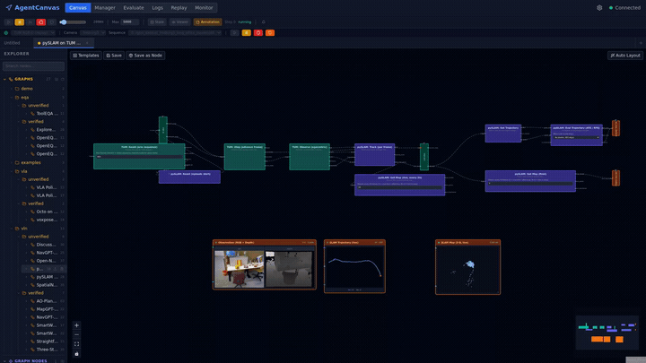

[English](../README.md) | [中文](README_zh.md) | **Español** | [日本語](README_ja.md) | [한국어](README_ko.md)

<div align="center">

# AgentCanvas

### Automating the Design of Embodied Agent Architectures

**Jian Zhou · Sihao Lin · Jin Li · Shuai Fu · Gengze Zhou · Qi Wu**

Australian Institute for Machine Learning, University of Adelaide

<p>
  <a href="https://arxiv.org/abs/2606.30111"></a>
  <a href="https://jianzhou0420.github.io/src/works/AgentCanvas/index.html"></a>
  <a href="https://jianzhou0420.github.io/src/works/AgentCanvas/paper.html"></a>
  <a href="https://jianzhou0420.github.io/AgentCanvas/"></a>
  <a href="#6-citación"></a>
</p>


<sub><em>Grabado en vivo en el editor — el ejecutor MapGPT se carga, luego un episodio real de R2R se ejecuta de extremo a extremo.</em></sub>

</div>

[](../LICENSE)
[](https://www.python.org/)
[](https://jianzhou0420.github.io/AgentCanvas/pages/developer-guide/repo/versioning.html)
[](https://github.com/jianzhou0420/AgentCanvas/stargazers)

**Una plataforma visual de diseño de agentes para la investigación en IA encarnada.** Un grafo tipado, dos roles: un *banco de pruebas* (harness) que ejecuta agentes encarnados, y un *andamiaje* (scaffold) que los agentes de programación editan y verifican.

AgentCanvas permite a los investigadores prototipar agentes encarnados — para VLN, EQA, VLA y tareas adyacentes — dibujando grafos de nodos que se ejecutan en tiempo real contra simuladores (Habitat-Sim, MatterSim, SAPIEN/ManiSkill2, MuJoCo/robosuite) o, en principio, configuraciones del mundo real. *Un JSON = un agente = un grafo*: el comportamiento del agente es un grafo de flujo de datos (dataflow graph), no código imperativo; el grafo es la fuente de verdad, guardado como un único archivo JSON y cargado como un agente completo.

**Diseñado para**: investigadores que quieren componer, comparar y compartir arquitecturas de agentes encarnados sin reescribir la pila de ejecución cada vez. La plataforma cubre VLN (Vision-and-Language Navigation), EQA (Embodied Question Answering), benchmarks de políticas VLA (Vision-Language-Action), y se adapta a otros entornos encarnados / agénticos mediante el modelo de nodeset.

> **Estado**: vista previa de investigación, pre-1.0 — más de 40 nodesets en cuatro paletas intercambiables (**env** · **method** · **model** · **policy**); la API pública aún no está congelada ([Política de Versionado](https://jianzhou0420.github.io/AgentCanvas/pages/developer-guide/repo/versioning.html)).

> **Contribuir**: nodesets, grafos y PRs al core, todos bienvenidos — cada contribución se acredita en el tablero de [Créditos](#créditos). Consulta [CONTRIBUTING.md](../CONTRIBUTING.md).

---

## ¡Novedades!

- [2026/07] 🚀 **Graph SDK — construye y ejecuta agentes en Python** — los mismos grafos del lienzo, ahora una librería importable: `from agentcanvas import Graph`, añade/conecta nodos, ejecuta y evalúa por lotes en el mismo proceso, o compila un grafo de vuelta a un script constructor independiente. El mismo `GraphDefinition`, totalmente reversible con el lienzo + JSON. Consulta la [documentación del Graph SDK](https://jianzhou0420.github.io/AgentCanvas/pages/developer-guide/capabilities/graph-sdk.html).
- [2026/07] 🎥 **Demo de SLAM clásico con pySLAM** — pySLAM como protagonista sobre TUM RGB-D: un entorno de reproducción en streaming alimenta una secuencia de benchmark fotograma a fotograma a una sesión de SLAM en vivo — la trayectoria estimada de la cámara ajustada sobre el ground truth en vista cenital y un mapa 3D disperso densificándose en tiempo real, sin simulador ni política, solo CPU. Clip completo + explicación en la [documentación del nodeset pySLAM](https://jianzhou0420.github.io/AgentCanvas/pages/developer-guide/nodesets/model/model-pyslam.html).

  [](https://jianzhou0420.github.io/AgentCanvas/pages/developer-guide/nodesets/model/model-pyslam.html)
- [2026/07] 🔥 **Mayor soporte de modelos fundacionales** — 29 modelos fundacionales están ahora cableados como carcasas ligeras en modo servidor (transformers-native + otras fuentes), disponibles tanto para grafos construidos a mano como para el optimizador AAS: VLMs recientes (Qwen3-VL, InternVL3, Gemma 3, SmolVLM2), percepción de vocabulario abierto (SigLIP2, OWLv2, Grounding DINO), y backbones de geometría / profundidad. Consulta la [cobertura de modelos fundacionales](https://jianzhou0420.github.io/AgentCanvas/pages/developer-guide/nodesets/model/index.html) y los [Créditos](https://jianzhou0420.github.io/AgentCanvas/pages/developer-guide/community/credits.html) por modelo.
- [2026/07] 🔥 **Edita el código fuente de los nodos desde el lienzo** — la nueva pestaña Source muestra el fragmento acotado del código fuente del nodeset del nodo seleccionado (globales, funciones referenciadas, la propia clase) y reincorpora las ediciones con recarga en caliente verificada sintácticamente. PR: [#5](https://github.com/jianzhou0420/AgentCanvas/pull/5).
- [2026/07] 🎉 **Primera publicación pública** — AgentCanvas se publica como código abierto en versión vista previa de investigación (pre-1.0). Documentación: [jianzhou0420.github.io/AgentCanvas](https://jianzhou0420.github.io/AgentCanvas/).

---

## Contenidos

1. [¿Por qué AgentCanvas?](#1-por-qué-agentcanvas) — un sustrato buscable para agentes encarnados, y los puntos débiles que resuelve
2. [Características](#2-características) — los principios *un JSON = un agente* (§2.2) / *una clase de Python = un nodo* (§2.6), además del editor de lienzo, ejecutor de grafos, entornos de ejecución aislados, grafos anidados, contenedores de estado, hooks
3. [Ruta de Sim a Real](#3-ruta-de-sim-a-real) — el mismo grafo de agente en el simulador hoy, robot real mañana — mediante env-como-nodeset + modo servidor + ROS
4. [Primeros Pasos](#4-primeros-pasos) — requisitos previos, ejecutar el panel web, ejecutar una evaluación, ejecutar la búsqueda de arquitectura, servir la documentación
5. [Contribuir](#5-contribuir) — dónde se necesita más ayuda · créditos
6. [Citación](#6-citación) — cómo citar el artículo de AgentCanvas
7. [Licencia](#7-licencia) — Apache 2.0

---

## 1. ¿Por qué AgentCanvas?

Los agentes encarnados — que abarcan VLN, EQA y VLA — se construyen cada vez más componiendo modelos fundacionales con percepción, mapeo, memoria, planificación y acción. A diferencia de las políticas de extremo a extremo, cuya estructura queda absorbida en los pesos, esta arquitectura es *explícita y editable*. Eso plantea la pregunta en torno a la cual se construye AgentCanvas — **¿puede el diseño de agentes buscarse en lugar de construirse a mano?** — junto con dos pilas de problemas que debe superar en el camino.

<details>
<summary><b>La arquitectura de agentes se construye a mano — y podría buscarse</b></summary>

<br>

Cada agente fija una elección en cada unión — abstracciones de sensores, representaciones de mapas, estado de memoria, estructura del prompt, topología del planificador, ubicación del modelo, interfaces de acción — a mano, normalmente para un único benchmark. A medida que los modelos fundacionales y las herramientas encarnadas se multiplican, el espacio crece más rápido de lo que la iteración manual puede cubrir, así que el movimiento natural es buscarlo en lugar de ajustarlo a mano.

La Búsqueda de Arquitectura de Agentes (Agent Architecture Search, AAS) ya hace esto para agentes del dominio del texto, pero la transferencia a lo encarnado no es gratuita: simuladores con estado, puntuación ruidosa multi-episodio, trazas largas de percepción/acción, y ninguna paleta lista para usar de primitivas encarnadas. AgentCanvas es nuestro intento de suministrar el sustrato que falta — un andamiaje que un agente de programación puede leer, editar, ejecutar y verificar — para que buscar el diseño de agentes también sea posible para los agentes encarnados.

</details>

<details>
<summary><b>Puntos débiles específicos de lo encarnado</b></summary>

<br>

- **La pila encarnada moderna es densa** — un agente encarnado funcional necesita razonamiento LLM + uso de herramientas + acoplamiento con el simulador + herramientas espaciales, todo cableado en conjunto. Construir esto desde cero por proyecto es prohibitivamente costoso, y la mayor parte del esfuerzo se dedica a la capa de ejecución en lugar de a la idea que se está probando.
- **Pesadilla de ingeniería** — un agente encarnado no es un modelo sino todo un sistema — un simulador con estado más una pila de modelos y herramientas pesados. Solo ejecutarlo, ya no digamos a la escala que requiere el benchmarking, es de por sí un trabajo de ingeniería arduo:
  - **Infierno de entornos Python** — ningún entorno Python único satisface cada parte; cada simulador, VLM, detector y política fija su propia versión incompatible de CUDA / torch / Python, así que encontrar un único runtime que todos compartan suele ser imposible — acabas manteniendo varios entornos incompatibles solo para cargar el agente.
  - **Batching** — el simulador de cada worker es un proceso con estado separado que avanza a su propio ritmo; puedes agrupar el modelo pero no los simuladores, así que cada paso se convierte en una danza asíncrona de recolectar-observaciones → inferir-en-lote → dispersar-acciones.
  - **Otra infraestructura** — trayectorias multimodales que deben registrarse y poder reproducirse, checkpoint/reanudación de ejecuciones de GPU de varias horas que *van a* fallar, y depuración a través de los límites entre procesos.

  A lo largo del ciclo de investigación de un solo artículo, el investigador paga demasiado de este coste de ingeniería en lugar de centrarse en el algoritmo en sí.
- **Dependencias ocultas de ground-truth** — muchos métodos dependen silenciosamente del ground truth proporcionado por el simulador (poses de objetos, etiquetas semánticas, navegabilidad) en lugar de la percepción real. A veces es una forma legítima de controlar el experimento — pero, sea descuido o no, a menudo no se menciona en el artículo.

</details>

<details>
<summary><b>Puntos débiles comunes de la investigación en IA (amplificados aquí)</b></summary>

<br>

- **Implementaciones no reproducibles** — cada artículo construye su agente desde cero con una base de código distinta; comparar métodos de forma justa o reproducir resultados es doloroso — y muchos de ellos son **`Code coming SOON`** (**S**omeday, **O**r **O**bviously **N**ever — algún día, o evidentemente nunca).
- **Artículo ≠ código** — los artículos muestran diagramas de flujo limpios, pero el código real diverge de formas no documentadas. Reproducir un artículo significa hacer ingeniería inversa de su implementación.
- **Código fuertemente acoplado** — la lógica de dominio (prompts, herramientas, políticas) está enredada con la infraestructura. Cambiar un componente significa reescribir el pipeline.

</details>

---

## 2. Características

> **Referencia completa en la documentación** — la mayoría de las funcionalidades de abajo tienen una página de implementación (mecanismo · archivos clave · estado actual): **[Las Nueve Capacidades →](https://jianzhou0420.github.io/AgentCanvas/pages/developer-guide/capabilities/index.html)**

<details>
<summary><b>Las nueve capacidades</b> — editor de lienzo · motor de grafos · runtimes aislados · grafos anidados · contenedores de estado · nodos definidos en Python · hooks · evaluación por lotes · observabilidad</summary>

<br>

### 2.1 Editor de Lienzo Visual

Un espacio de trabajo plano al estilo ComfyUI donde coexisten todos los tipos de nodos — entornos, LLMs, cadenas de razonamiento, compuertas de control y visores de salida. Arrastra nodos desde la barra lateral, conéctalos entre sí, pulsa Play.

### 2.2 Motor de Ejecución de Grafos (Graph Execution Engine)

**Un JSON = un agente.** Todo el comportamiento de un agente — nodos, cableado, configuraciones, contenedores de estado, hooks — es un único archivo JSON: cárgalo, ejecútalo, compártelo, haz un diff. Sin código de pipeline oculto; lo que ves en el lienzo es lo que se ejecuta.

```jsonc
// Simplified — real graphs include state containers, hooks, and more nodes
{
  "name": "NavGPT-CE",
  "description": "VLN reasoning graph with planner, VLM, and navigation memory",
  "kind": "graph",
  "nodes": [
    { "id": "observe", "type": "env_habitat__observe_egocentric", "config": {} },
    { "id": "planner", "type": "llmCall",                         "config": { "temperature": 0.0 } },
    { "id": "step",    "type": "env_habitat__step_discrete",      "config": {} }
  ],
  "edges": [
    { "source": "observe", "sourceHandle": "rgb", "target": "planner", "targetHandle": "image" },
    { "source": "planner", "sourceHandle": "action", "target": "step", "targetHandle": "action" }
  ]
}
```

El motor entonces ejecuta ese grafo: los nodos se disparan cuando llegan sus entradas, no en un orden fijo. El mismo motor maneja cada forma de grafo que AgentCanvas v1 admite — consulta [`major-versions.html`](https://jianzhou0420.github.io/AgentCanvas/pages/developer-guide/core/major-versions.html) para la lista completa de formas de agente cubiertas por el paradigma de topología-estática-acotada de v1:

- **Flujos de trabajo DAG** — una sola pasada hacia adelante para pipelines acíclicos
- **Bucles de agente cíclicos** — observar-pensar-actuar-repetir mediante un modelo de **dos pivotes**: un **`IterIn`** de dos lados (entradas de inicialización al arranque de la ejecución a su izquierda, acarreo de bucle por iteración a su derecha) más **`IterOut`**, manteniendo el grafo visualmente acíclico a la vez que habilita ciclos en tiempo de ejecución (ADR-dataflow-008, que plegó el anterior modelo de tres pivotes `initialize`/IterIn/IterOut de ADR-dataflow-006 a dos)
- **Iteración multi-ámbito** — N pares `(IterIn, IterOut)` coexistiendo en un único grafo plano (ADR-dataflow-007 / ADR-executor-003)
- **Bucles ReAct** — ya sea ocultos dentro de una subclase `LLMCallNode` o expresados explícitamente como router + N ramas de herramientas predeclaradas
- **Multi-agente acotado** — fan-out de N-fijo o acotado por `K_max` (p. ej., debate al estilo DiscussNav, roles fijos al estilo AutoGen)
- **Plan-and-Execute** — sobre un pool de herramientas acotado, despachado por router

El motor también es extensible sin tocar los nodos del grafo: hooks de shell se disparan antes/después de cada ejecución de nodo y en los límites del ciclo de vida del grafo — registrar salidas, validar entradas, bloquear nodos o modificar datos — y viajan con los grafos guardados.

### 2.3 Entornos de Ejecución Aislados

Las herramientas de investigación a menudo necesitan entornos Python en conflicto (Habitat necesita Python 3.8, SLAM necesita ROS). Cualquier `BaseNodeSet` puede ejecutarse en **modo servidor** (server mode) — el framework auto-genera un servidor HTTP a partir de las definiciones de puertos del nodeset, ejecutándose en su propio intérprete. Cero código adicional:

```
# Same nodeset code, two deployment modes:
POST /api/components/nodesets/env_habitat/load              # in-process
POST /api/components/nodesets/env_habitat/load?mode=server  # separate process
```

### 2.4 Sistema de Grafos Anidados

Guarda cualquier grafo del lienzo como un **graph node** y arrástralo a otro lienzo como un bloque reutilizable. Esto habilita arquitecturas de agentes jerárquicas — un planificador de alto nivel que contiene graph nodes de subagentes. Semántica de instantánea: cada instancia es una copia profunda.

### 2.5 Sistema de Contenedores de Estado

Estado persistente compartido a través de las iteraciones del bucle del agente mediante una arquitectura de doble cableado:

- Las **aristas de datos** (data edges) transportan el flujo de datos entre nodos (IMAGE, TEXT, ACTION, POSE, …)
- Las **concesiones de acceso** (access grants) permiten a los nodos leer/escribir **StateContainers** — elementos visibles del lienzo con entradas nombradas, reductores configurables (Accumulator, LastWrite, Counter), y un eje de **Lifetime** (`forever` / `step` / `episode` / `run` / `custom`) que limpia automáticamente la memoria en el límite de señal correcto (ADR-dataflow-002, ADR-dataflow-004)

→ [Documento de diseño de State Containers](https://jianzhou0420.github.io/AgentCanvas/pages/developer-guide/design-docs/graph/state-containers.html)

### 2.6 Nodos Definidos en Python

**Una clase de Python = un nodo.** Cada nodo del lienzo — herramientas, entornos, habilidades, políticas — es una única clase de Python: declara los puertos, implementa `forward()`, deja el archivo en `workspace/`, y la plataforma lo auto-descubre. Sin cambios en el framework, sin TypeScript, sin código repetitivo de registro.

```python
from app.components import BaseCanvasNode, PortDef

class MeasureDistanceNode(BaseCanvasNode):
    node_type    = "basic_agent__measure_distance"
    display_name = "Measure Distance"
    description  = "Euclidean distance between two 3D positions"
    category     = "tool"
    icon         = "Ruler"

    input_ports  = [
        PortDef("pos_a", "TEXT", "Position A as [x, y, z]"),
        PortDef("pos_b", "TEXT", "Position B as [x, y, z]"),
    ]
    output_ports = [
        PortDef("distance", "TEXT", "Euclidean distance (meters)"),
    ]

    async def forward(self, inputs, ctx):
        a, b = parse_vec3(inputs["pos_a"]), parse_vec3(inputs["pos_b"])
        dist = math.sqrt(sum((ai - bi) ** 2 for ai, bi in zip(a, b)))
        return {"distance": f"{dist:.2f}"}
```

El nodo entonces aparece en la barra lateral del lienzo y se conecta con cualquier otro nodo con tipos de puerto compatibles. Su apariencia también está gobernada por Python: `GenericBlockRenderer` renderiza cualquier nodo automáticamente a partir de `NodeUIConfig` — colores, disposición, controles de configuración en línea (sliders, desplegables, campos de texto) y widgets de visualización — así que no se necesita ningún componente React personalizado.

### 2.7 Evaluación por Lotes y Cola de Trabajos

El mismo grafo que se ejecuta en el lienzo puede enviarse como un trabajo de evaluación que lo puntúa sobre cientos de episodios. Un `JobScheduler` propiedad del backend controla la admisión frente a un presupuesto de VRAM compartido entre todas las sesiones (ADR-eval-003); cada ejecución admitida es su propio subproceso cuya vida útil está ligada al backend (`PR_SET_PDEATHSIG`) — sin procesos de GPU huérfanos, y cada episodio finalizado persiste en disco. Los registros por episodio aterrizan en una disposición autocontenida (ADR-eval-004) para que un compañero de equipo pueda reproducir cualquier episodio individual sin volver a ejecutar.

### 2.8 Registros de Ejecución y Vistas en Vivo

Cada paso transmite observaciones, razonamiento, acciones y métricas vía WebSocket, enrutadas por `execution_id` para que las ejecuciones concurrentes no crucen sus flujos. Los errores de cualquier fuente — excepciones de nodos, caídas de subprocesos en modo servidor y fallos HTTP — fluyen a través de un `ErrorBus` unificado y aparecen como entradas en la pestaña Report + toasts (ADR-observability-004). (Los errores de renderizado de React son capturados por un error boundary del lado del cliente.)

</details>

---

## 3. Ruta de Sim a Real

AgentCanvas está diseñado para la portabilidad: un único grafo de agente puede ejecutarse contra un simulador hoy y migrar a un robot real en el futuro sin cambios a nivel de grafo. Esta propiedad se deriva de dos decisiones arquitectónicas — los entornos son ellos mismos nodesets (ADR-components-002), y cualquier nodeset puede ejecutarse en un runtime aislado mediante el *modo servidor* (ADR-server-001).

<details>
<summary><b>La ruta completa</b> — los simuladores de hoy · un nodeset de ROS con la misma interfaz · integración bidireccional · visibilidad del ground-truth</summary>

<br>

### Hoy: Nodesets de Simulador

Los entornos incluidos — Habitat (VLN-CE), MatterSim / MP3D, HM-EQA, OpenEQA, SIMPLER (VLA real-a-sim), y LIBERO (manipulación) — están cada uno implementados como un `BaseNodeSet` que expone puertos de observación y acción. El grafo de agente se conecta a estos puertos y nunca importa el simulador directamente, lo que mantiene el grafo independiente de cualquier implementación de entorno específica.

### Mañana: Un Nodeset de ROS con la Misma Interfaz

El despliegue en robot real se logra reemplazando el nodeset de simulador por un **nodeset de ROS** que expone la misma interfaz `observation` / `act`. Internamente, este nodeset compone componentes de ROS existentes — `cv_bridge`, `Nav2`, `MoveIt` y paquetes de drivers de hardware — en una fachada unificada. El modo servidor lanza el nodeset dentro de su propio entorno Python de ROS y lo conecta con el lienzo por HTTP. El grafo de agente en sí permanece sin cambios.

Esta división del trabajo es favorable porque la ingeniería sustancial — percepción, control, planificación de movimiento e interfaz con el hardware — ya existe como paquetes de ROS maduros. El adaptador del lado de ROS es por tanto una tarea de composición en lugar de desarrollo desde cero, y el nodeset de entorno del lado de AgentCanvas se reduce a un cliente HTTP ligero.

### Integración Bidireccional

El límite entre AgentCanvas y ROS es simétrico; cualquiera de los dos lados puede ser dueño del bucle de control:

- **ROS como subsistema de AgentCanvas** *(patrón nativo; el modo servidor está diseñado para este caso)* — el nodeset de ROS se ejecuta en modo servidor, AgentCanvas dirige el bucle del agente, y ROS proporciona el sensado y la actuación.
- **AgentCanvas como subsistema de ROS** *(también admitido; no requiere modificaciones del framework)* — cuando el proyecto más amplio está liderado por ROS, el bucle de control del lado de ROS invoca el endpoint `/run` de AgentCanvas en cada paso (tratando el grafo como una política) y publica la acción devuelta. Esto solo requiere un nodo puente de ROS ligero del lado de ROS.

### Visibilidad de las Dependencias de Ground-Truth

La misma abstracción de nodeset aborda directamente dos puntos débiles planteados en §1. Un nodo que consulta el ground truth del simulador (p. ej., `env_habitat__get_object_pose`) y un nodo que realiza percepción real (p. ej., un detector basado en SAM) aparecen como bloques visiblemente distintos en el lienzo. Que un agente dependa del ground truth o de la percepción es por tanto una propiedad de la topología del grafo, no un detalle de implementación oculto. Sustituir uno por el otro es un cambio de arista local, no una refactorización de código.

### Estado

Todos los nodesets de entorno incluidos actualmente están basados en simuladores. Un **nodeset de ROS para robot real sigue siendo una ranura [en busca de contribución](#5-contribuir)** — el camino arquitectónico está establecido y es intencional, y los componentes necesarios del lado de ROS ya están disponibles en el ecosistema.

</details>

---

## 4. Primeros Pasos

Hay dos formas de usar AgentCanvas, ambas sobre el mismo sustrato de grafo tipado:

1. **Construir y ejecutar un grafo a mano** — compón nodos en el lienzo, ejecuta un agente en vivo contra un simulador, y evalúalo a escala (el resto de esta sección).
2. **Búsqueda de Arquitectura de Agentes (AAS)** — entrega un grafo semilla a un agente de programación y deja que busque arquitecturas por ti ([saltar](#44-ejecutar-la-búsqueda-de-arquitectura-de-agentes-aas)).

### 4.1 Requisitos Previos

- Python 3.10+ con Conda (el entorno `agentcanvas` por defecto — ADR-platform-004)
- Node.js 18+
- *(Opcional, para Habitat-Sim)* un entorno Python 3.8 separado — `habitat-sim 0.1.7` solo se ejecuta aquí; AgentCanvas se comunica con él mediante el modo servidor, consulta [INSTALL.md](INSTALL.md)

### 4.2 Ejecutar el Panel Web

```bash
# Activate environment
conda activate agentcanvas

# Start backend (FastAPI :8000) + frontend (Vite :5173)
cd agentcanvas && bash run_dev.sh
```

Abre [http://localhost:5173](http://localhost:5173) para acceder al editor de lienzo.

### 4.3 Ejecutar una Evaluación

El mismo pipeline de evaluación se expone a través de cuatro interfaces — elige según lo que tengas a mano:

| # | Interfaz | Audiencia | Ideal para |
|---|-----------|----------|----------|
| 1 | **Página de Evaluación del frontend** | Humano                | Guiado por clics, observa el progreso en vivo en la UI |
| 2 | **Comando slash `/experiment:run`** | Agente de programación (Claude Code) | Admisión de GPU controlada por perfil, puerto auto-asignado, sin pisar `:8000` |
| 3 | **Servidor MCP** | Agente de programación              | Evaluación conversacional y ad-hoc — sin sobrecarga de comandos slash |
| 4 | **API HTTP** | Scripts / CI                | REST directo, sin necesidad de MCP |

#### 1. Página de Evaluación del frontend — para humanos

Abre un grafo guardado en la página **Eval**, elige un split + rango de episodios, pulsa **Start**. El progreso se transmite en vivo por WebSocket; los resultados aterrizan como JSONL por episodio bajo `outputs/eval_runs/{run_id}/episodes/ep{NNNN}/` (ADR-eval-004) y se pueden explorar en el panel Run Detail. El fan-out de entornos multi-worker y la inferencia por lotes son configurables desde el formulario (ADR-eval-002).

→ [Tutorial de Evaluación por Lotes](https://jianzhou0420.github.io/AgentCanvas/pages/developer-guide/tutorials/batch-eval.html)

#### 2. `/experiment:run` — para agentes de programación en este repositorio

Al usar Claude Code, `/experiment:run <profile> -- <cmd>` envuelve cualquier invocación de evaluación en la compuerta de admisión del `JobScheduler` del backend (ADR-eval-003): el wrapper reclama VRAM bajo el perfil declarado en `.claude/commands/experiment/profiles.yaml`, lanza el backend en un puerto asignado (`BACKEND_URL=http://127.0.0.1:<port>` se exporta al comando envuelto), y libera la ranura al salir. Comandos complementarios: `/experiment:status` para instantáneas de ejecución, `/experiment:teardown` para una cancelación elegante.

→ [`.claude/commands/experiment/README.md`](../.claude/commands/experiment/README.md)

Para bucles completos de diseño de búsqueda de arquitectura (muchas iteraciones de proponer → evaluar → quedarse-con-el-mejor sobre un grafo semilla), consulta [Ejecutar la Búsqueda de Arquitectura de Agentes](#44-ejecutar-la-búsqueda-de-arquitectura-de-agentes-aas) más abajo.

#### 3. Servidor MCP — para agentes de programación

Registra `agentcanvas-backend` con cualquier cliente compatible con MCP (Claude Code, Cursor, …) y llama a herramientas tipadas (`graph_list`, `eval_start`, `eval_status`, `eval_export`, `eval_stop`) de forma conversacional. Sin contabilidad de árbol de iteraciones — solo evaluación directa contra un backend prestado-o-lanzado.

→ [`agentcanvas/mcp_server/README.md`](../agentcanvas/mcp_server/README.md)

#### 4. API HTTP — para scripts y CI

REST directo para scripts, CI o entornos sin MCP:

```bash
curl -X POST http://localhost:8000/api/eval/v2/start \
  -H 'content-type: application/json' \
  -d '{"graph_name": "navgpt_ce", "split": "val_unseen", "worker_count": 4}'
# poll  GET /api/eval/v2/status
# fetch GET /api/eval/v2/export/{run_id}
```

→ [Controlar el Backend desde un Agente de Programación](https://jianzhou0420.github.io/AgentCanvas/pages/developer-guide/tutorials/coding-agent-backend.html) — análisis profundo de todos los modos programáticos en paralelo

### 4.4 Ejecutar la Búsqueda de Arquitectura de Agentes (AAS)

Más allá de evaluar un grafo fijo, AgentCanvas es el sustrato para la **Búsqueda de Arquitectura de Agentes** — un bucle en tiempo de desarrollo donde un *Optimizer* agente-de-programación LLM propone repetidamente ediciones de grafo a un *Executor* semilla, evalúa cada candidato en el simulador, y conserva las mejoras (§1 — [por qué un sustrato buscable](#1-por-qué-agentcanvas)). Como un agente es un grafo tipado, cada candidato es un parche con tipos verificados que se ejecuta antes de cualquier rollout costoso, y los registros de episodios por nodo permiten al Optimizer atribuir los cambios de puntuación a módulos específicos.

<p align="center">
  
  <br><sub><em>El optimizador agente-de-programación buscando sobre el grafo de un ejecutor encarnado — proponer una edición, ejecutarla, conservar las ganancias.</em></sub>
</p>

La búsqueda está **sembrada por método**: `iter_0` es un método encarnado publicado y el bucle busca ediciones a nivel de grafo a su alrededor. Tres variantes de búsqueda se incluyen como skills de Claude Code bajo `.claude/commands/architect/`, compartiendo un único harness de agente-de-programación (proposer → implementer → evaluator) y diferenciándose solo en la lógica del proposer + la memoria persistente:

| Skill de variante | Nombre en el artículo | Política de búsqueda |
|---|---|---|
| `myloop` | **KDLoop** | Ciclo de cuatro fases THINK → CRITIC → EXPERIMENT → DISTILL, memoria tipada + meta-fase REFLECT |
| `adas-subagent` | **ADAS** (port) | Propuestas estilo Reflexion sobre un archivo plano de solo-anexado |
| `aflow` | **AFlow** (port) | Selección de padre por score-softmax + memoria anti-repetición |

```text
# In a Claude Code session on this repo — run KDLoop over the MapGPT executor
/architect:myloop:loop mapgpt_mp3d --goal "raise val_unseen SR"

# The ADAS / AFlow ports take the same  <graph> [<version>]  form
/architect:adas-subagent:loop smartway_ce
/architect:aflow:loop explore_eqa_hmeqa
```

Grafos semilla actualmente cableados para búsqueda: `mapgpt_mp3d`, `smartway_ce` (VLN), `explore_eqa_hmeqa` (EQA), `voxposer_libero_monolithic` (VLA). Cada iteración escribe su propuesta, parche, puntuaciones de evaluación y registros bajo `outputs/design_runs/{variant}/{graph}/vN/iter_M/`.

→ [Referencia de pipelines de AAS](https://jianzhou0420.github.io/AgentCanvas/pages/aas/index.html)

### 4.5 Documentación

```bash
# Serve the doc-site locally on :8092 (live-reload via SSE)
bash docs/run_dev.sh
```

---

## 5. Contribuir

Dos tipos de contribución, ambos bienvenidos — consulta [CONTRIBUTING.md](../CONTRIBUTING.md):

- **Contenido — nodesets y grafos.** Escribe un nodeset que envuelva una herramienta / simulador / modelo (p. ej. 3D Gaussian Splatting en tiempo real, un sistema SLAM basado en vóxeles) o que codifique un método (p. ej. NavGPT, MapGPT), o compón un grafo que cablee nodesets existentes en un agente completo. Abre un PR a `workspace/`; la revisión es ligera.
- **Core — UI, backend, framework.** Correcciones de errores, nuevas funcionalidades, incluso refactorizaciones son bienvenidas. La única petición: si un cambio es lo suficientemente grande como para costar tiempo real, abre primero una [Discussion](https://github.com/jianzhou0420/AgentCanvas/discussions) para que podamos alinearnos antes de que construyas.

Cada nodeset y grafo se acredita a su autor/mantenedor en el tablero de abajo — con un enlace de cita si tiene un artículo asociado — así que contribuir aquí no te cuesta la autoría. El **framework AgentCanvas** y los **métodos, grafos e integraciones de entornos** de la primera publicación son obra de **AC-Team**. Los **modelos fundacionales y políticas** de abajo son de **terceros** — AgentCanvas incluye solo un wrapper ligero en modo servidor para que cada uno se enchufe al grafo (tanto para usuarios humanos como para el optimizador AAS); el crédito de cada modelo pertenece a sus autores originales — los modelos fundacionales se recogen en una **tabla separada más abajo**, divididos por fuente (transformers-native vs. `torch.hub` / `torchvision` / repo upstream incorporado), con atribución completa por modelo en la página de Créditos. El tablero es solo-nombres por diseño: el **inventario canónico** con el detalle de verificación por grafo vive en la [página de Créditos del doc-site](https://jianzhou0420.github.io/AgentCanvas/pages/developer-guide/community/credits.html) y en las páginas de estado de soporte [VLN](https://jianzhou0420.github.io/AgentCanvas/pages/developer-guide/nodesets/status/vln-support-status.html) / [EQA](https://jianzhou0420.github.io/AgentCanvas/pages/developer-guide/nodesets/status/eqa-support-status.html) / [VLA](https://jianzhou0420.github.io/AgentCanvas/pages/developer-guide/nodesets/status/vla-support-status.html).

### Créditos

✅ verificado — reproduce su artículo / implementación de referencia · 🚧 se ejecuta de extremo a extremo, verificación en progreso

<table>
  <thead align="center">
    <tr>
      <th>Entornos</th>
      <th>Métodos</th>
      <th>Modelos y Políticas</th>
    </tr>
  </thead>
  <tbody valign="top">
    <tr>
      <td>
        <ul>
          <li><a href="https://jianzhou0420.github.io/AgentCanvas/pages/developer-guide/nodesets/env/habitat.html">Habitat (VLN-CE)</a> ✅</li>
          <li><a href="https://jianzhou0420.github.io/AgentCanvas/pages/developer-guide/nodesets/env/matterport3d.html">MatterSim / MP3D</a> ✅</li>
          <li><a href="https://jianzhou0420.github.io/AgentCanvas/pages/developer-guide/nodesets/env/hmeqa.html">HM-EQA</a> ✅</li>
          <li><a href="https://jianzhou0420.github.io/AgentCanvas/pages/developer-guide/nodesets/env/openeqa.html">OpenEQA (EM-EQA)</a> ✅</li>
          <li><a href="https://jianzhou0420.github.io/AgentCanvas/pages/developer-guide/nodesets/env/simpler.html">SIMPLER</a> ✅</li>
          <li><a href="https://jianzhou0420.github.io/AgentCanvas/pages/developer-guide/nodesets/env/libero.html">LIBERO</a> ✅</li>
        </ul>
      </td>
      <td>
        <ul>
          <li><b>VLN</b>
            <ul>
              <li><a href="https://jianzhou0420.github.io/AgentCanvas/pages/developer-guide/nodesets/method/navgpt.html">NavGPT</a> ✅</li>
              <li><a href="https://jianzhou0420.github.io/AgentCanvas/pages/developer-guide/nodesets/method/mapgpt.html">MapGPT</a> ✅</li>
              <li><a href="https://jianzhou0420.github.io/AgentCanvas/pages/developer-guide/nodesets/method/smartway.html">SmartWay</a> ✅</li>
              <li><a href="https://jianzhou0420.github.io/AgentCanvas/pages/developer-guide/nodesets/method/threestepnav.html">Three-Step Nav</a> ✅</li>
              <li><a href="https://jianzhou0420.github.io/AgentCanvas/pages/developer-guide/nodesets/method/aoplanner.html">AO-Planner</a> ✅</li>
              <li><a href="https://jianzhou0420.github.io/AgentCanvas/pages/developer-guide/nodesets/method/discussnav.html">DiscussNav</a> 🚧</li>
              <li>Open-Nav 🚧</li>
              <li>SpatialNav 🚧</li>
              <li><a href="https://jianzhou0420.github.io/AgentCanvas/pages/developer-guide/nodesets/common/tools/basic-agent.html">Kit de herramientas Basic Agent</a> ✅</li>
            </ul>
          </li>
          <li><b>EQA</b>
            <ul>
              <li><a href="https://jianzhou0420.github.io/AgentCanvas/pages/developer-guide/nodesets/env/openeqa.html">Baselines de EM-EQA</a> ✅</li>
              <li><a href="https://jianzhou0420.github.io/AgentCanvas/pages/developer-guide/nodesets/method/explore-eqa.html">Explore-EQA</a> ✅</li>
              <li>ToolEQA 🚧</li>
            </ul>
          </li>
          <li><b>VLA (zero-shot)</b>
            <ul>
              <li><a href="https://jianzhou0420.github.io/AgentCanvas/pages/developer-guide/nodesets/method/voxposer.html">VoxPoser-LIBERO</a> ✅</li>
            </ul>
          </li>
        </ul>
      </td>
      <td>
        <ul>
          <li><b>Políticas</b>
            <ul>
              <li><a href="https://jianzhou0420.github.io/AgentCanvas/pages/developer-guide/nodesets/method/policy-cma.html">CMA</a> ✅</li>
              <li>Octo (baseline de SIMPLER) ✅</li>
              <li><a href="https://jianzhou0420.github.io/AgentCanvas/pages/developer-guide/nodesets/method/policy-vla.html">Framework VLA (Pi0 / SmolVLA / DP / DROID-DP)</a> 🚧</li>
              <li><a href="https://jianzhou0420.github.io/AgentCanvas/pages/developer-guide/nodesets/method/policy-adapters.html">Registro de políticas R2R-CE (12 variantes)</a> 🚧</li>
            </ul>
          </li>
          <li><b>Mapeo</b> <sub><i>(creado por AgentCanvas)</i></sub>
            <ul>
              <li>Mapeo TSDF ✅</li>
              <li>Grafo semántico de escena ✅</li>
            </ul>
          </li>
        </ul>
      </td>
    </tr>
  </tbody>
</table>

**Modelos fundacionales** — modelos de terceros envueltos tras **una única carcasa de nodeset ligera** (carga perezosa · GPU single-flight · sobre de flujo de datos base64-npy) para que cada uno sea un bloque de construcción uniforme tanto para **usuarios humanos** como para el **optimizador AAS**. *No somos autores de estos — solo distribuimos la carcasa; el crédito pertenece a los autores originales* (atribución completa por modelo + artículos en la [página de Créditos](https://jianzhou0420.github.io/AgentCanvas/pages/developer-guide/community/credits.html)). Divididos por fuente:

<table>
  <thead align="center">
    <tr>
      <th>transformers-native <sub>(wrapper ligero sobre <code>AutoModel</code> / <code>pipeline</code>)</sub></th>
      <th>Otras fuentes <sub>(<code>torch.hub</code> / <code>torchvision</code> / repo upstream incorporado)</sub></th>
    </tr>
  </thead>
  <tbody valign="top">
    <tr>
      <td>
        <ul>
          <li><a href="https://jianzhou0420.github.io/AgentCanvas/pages/developer-guide/nodesets/model/model-clip.html">CLIP</a></li>
          <li><a href="https://jianzhou0420.github.io/AgentCanvas/pages/developer-guide/nodesets/model/model-siglip2.html">SigLIP 2</a></li>
          <li><a href="https://jianzhou0420.github.io/AgentCanvas/pages/developer-guide/nodesets/model/model-aimv2.html">AIMv2</a></li>
          <li><a href="https://jianzhou0420.github.io/AgentCanvas/pages/developer-guide/nodesets/model/model-owlv2.html">OWLv2</a></li>
          <li><a href="https://jianzhou0420.github.io/AgentCanvas/pages/developer-guide/nodesets/model/model-sam.html">SAM</a></li>
          <li><a href="https://jianzhou0420.github.io/AgentCanvas/pages/developer-guide/nodesets/model/model-sam-video.html">SAM Video</a></li>
          <li><a href="https://jianzhou0420.github.io/AgentCanvas/pages/developer-guide/nodesets/model/model-segmentation.html">Segmentación (Mask2Former)</a></li>
          <li><a href="https://jianzhou0420.github.io/AgentCanvas/pages/developer-guide/nodesets/model/model-florence2.html">Florence-2</a></li>
          <li><a href="https://jianzhou0420.github.io/AgentCanvas/pages/developer-guide/nodesets/model/model-depth-anything.html">Depth Anything V2</a></li>
          <li><a href="https://jianzhou0420.github.io/AgentCanvas/pages/developer-guide/nodesets/model/model-depthpro.html">DepthPro</a></li>
          <li><a href="https://jianzhou0420.github.io/AgentCanvas/pages/developer-guide/nodesets/model/model-normal.html">Normales de superficie (Sapiens)</a></li>
          <li><a href="https://jianzhou0420.github.io/AgentCanvas/pages/developer-guide/nodesets/model/model-pointmap.html">Mapa de puntos (Sapiens 3D)</a></li>
          <li><a href="https://jianzhou0420.github.io/AgentCanvas/pages/developer-guide/nodesets/model/model-matching.html">SuperPoint + LightGlue</a></li>
          <li><a href="https://jianzhou0420.github.io/AgentCanvas/pages/developer-guide/nodesets/model/model-blip2.html">BLIP-2</a> + Faster R-CNN</li>
          <li><a href="https://jianzhou0420.github.io/AgentCanvas/pages/developer-guide/nodesets/model/model-instructblip.html">InstructBLIP</a></li>
          <li><a href="https://jianzhou0420.github.io/AgentCanvas/pages/developer-guide/nodesets/model/vlm-qwen2-5-vl.html">Qwen2.5-VL</a></li>
          <li><a href="https://jianzhou0420.github.io/AgentCanvas/pages/developer-guide/nodesets/model/vlm-qwen3-vl.html">Qwen3-VL</a> <sub>(imagen + vídeo)</sub></li>
          <li><a href="https://jianzhou0420.github.io/AgentCanvas/pages/developer-guide/nodesets/model/vlm-internvl3.html">InternVL3</a> <sub>(imagen + vídeo)</sub></li>
          <li><a href="https://jianzhou0420.github.io/AgentCanvas/pages/developer-guide/nodesets/model/vlm-gemma3.html">Gemma 3</a> <sub>(acceso restringido)</sub></li>
          <li><a href="https://jianzhou0420.github.io/AgentCanvas/pages/developer-guide/nodesets/model/vlm-smolvlm2.html">SmolVLM2</a> <sub>(imagen + vídeo)</sub></li>
        </ul>
      </td>
      <td>
        <ul>
          <li><a href="https://jianzhou0420.github.io/AgentCanvas/pages/developer-guide/nodesets/model/model-dinov2.html">DINOv2 / DINOv3</a> <sub>(torch.hub + transformers hf)</sub></li>
          <li><a href="https://jianzhou0420.github.io/AgentCanvas/pages/developer-guide/nodesets/model/model-grounding-dino.html">Grounding DINO</a> <sub>(groundingdino-py + transformers hf_tiny)</sub></li>
          <li><a href="https://jianzhou0420.github.io/AgentCanvas/pages/developer-guide/nodesets/model/model-opticalflow.html">Flujo óptico (RAFT)</a> <sub>(torchvision)</sub></li>
          <li><a href="https://jianzhou0420.github.io/AgentCanvas/pages/developer-guide/nodesets/model/model-vggt.html">VGGT</a> <sub>(repo upstream)</sub></li>
          <li><a href="https://jianzhou0420.github.io/AgentCanvas/pages/developer-guide/nodesets/model/model-cotracker.html">CoTracker</a> <sub>(repo upstream)</sub></li>
          <li><a href="https://jianzhou0420.github.io/AgentCanvas/pages/developer-guide/nodesets/model/model-detany3d.html">DetAny3D</a> <sub>(incorporado)</sub></li>
          <li><a href="https://jianzhou0420.github.io/AgentCanvas/pages/developer-guide/nodesets/model/model-ram.html">RAM / RAM++</a> <sub>(recognize-anything)</sub></li>
          <li><a href="https://jianzhou0420.github.io/AgentCanvas/pages/developer-guide/nodesets/model/vlm-spatialbot.html">SpatialBot</a> <sub>(código remoto de Bunny)</sub></li>
          <li><a href="https://jianzhou0420.github.io/AgentCanvas/pages/developer-guide/nodesets/model/vlm-prismatic.html">Prismatic VLM</a> <sub>(repo upstream)</sub></li>
        </ul>
      </td>
    </tr>
  </tbody>
</table>

**En busca de contribución** — ranuras reservadas, acreditadas a quien las complete ([cómo contribuir](../CONTRIBUTING.md); los IDs son ranuras del roadmap en la [página de Créditos](https://jianzhou0420.github.io/AgentCanvas/pages/developer-guide/community/credits.html)):

<table>
  <thead align="center">
    <tr>
      <th>Benchmarks</th>
      <th>Métodos</th>
      <th>Funcionalidades e Infraestructura</th>
    </tr>
  </thead>
  <tbody valign="top">
    <tr>
      <td>
        <ul>
          <li>AI2-THOR — ALFRED / TEACh <i>(E4)</i></li>
          <li>RxR-CE — VLN-CE multilingüe <i>(E2)</i></li>
          <li>REVERIE — grounding de objetos remotos <i>(E3)</i></li>
          <li>OpenEQA A-EQA — EQA activo <i>(E10)</i></li>
        </ul>
      </td>
      <td>
        <ul>
          <li>HAMT — transformer de historia jerárquica <i>(M5)</i></li>
          <li>DUET — transformer de grafos de doble escala <i>(M6)</i></li>
          <li>InstructNav — CoN dinámico + mapas de valor <i>(M8)</i></li>
          <li>VLN-SIG — grounding de sub-instrucciones <i>(M4)</i></li>
        </ul>
      </td>
      <td>
        <ul>
          <li>Nodeset de memoria — recuerdo episódico + búsqueda semántica <i>(F1)</i></li>
          <li>Ejecución paralela de nodos — superpasos Pregel <i>(F3)</i></li>
          <li>Exportar grafo como Python independiente <i>(F4)</i></li>
          <li>Modo servidor Docker — contenedores Habitat / MP3D <i>(F7)</i></li>
          <li>Nodeset de ROS — despliegue en robot real (<a href="#3-ruta-de-sim-a-real">§3</a>)</li>
        </ul>
      </td>
    </tr>
  </tbody>
</table>


---

## 6. Citación

Si utilizas AgentCanvas en tu investigación, cítalo así:

```bibtex
@misc{jian2026AgentCanvas,
  title         = {Automating the Design of Embodied Agent Architectures},
  author        = {Jian Zhou and Sihao Lin and Jin Li and Shuai Fu and Gengze Zhou and Qi Wu},
  year          = {2026},
  eprint        = {2606.30111},
  archivePrefix = {arXiv},
  primaryClass  = {cs.RO},
  url           = {https://arxiv.org/abs/2606.30111}
}
```

## 7. Licencia

Licencia Apache 2.0 — consulta [LICENSE](../LICENSE).
